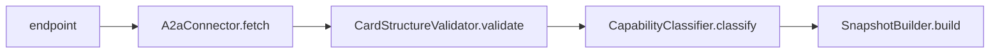

 

# a2a-agent-validator

Validates A2A Protocol Agent Cards end-to-end. Fetches the well-known endpoint, validates card structure against the A2A spec, classifies capabilities, and returns a structured snapshot with 12 boolean categories and 13 entry fields. Compatible with `erc8004-registry-parser` as a validation plugin.

## Quickstart

```bash
git clone https://github.com/FlowMCP/a2a-agent-validator.git
cd a2a-agent-validator
npm i
```

```javascript
import { A2aAgentValidator } from 'a2a-agent-validator'

const { status, messages, categories, entries } = await A2aAgentValidator.start( {
    endpoint: 'https://agent.example.com',
    timeout: 15000
} )
```

## Features

- Fetches Agent Card from `/.well-known/agent-card.json` (A2A spec standard)
- Validates card structure: required fields, interfaces, skills, provider
- Classifies 12 boolean categories (reachable, skills, streaming, JSONRPC, GRPC, security)
- Extracts 13 entry fields (name, version, skills, protocols, provider)
- Compares two snapshots and produces a structured diff
- Returns empty snapshot with all-false categories on connection failure
- Compatible with `erc8004-registry-parser` via `.validate()` method

## Architecture

The validation pipeline processes an A2A Agent Card in four sequential steps:



## Methods

All methods are static and use object parameters with object returns.

### `.validate( { endpoint } )`

Simple validation compatible with `erc8004-registry-parser`. Returns only status and messages.

**Method**

```
.validate( { endpoint } )
```

| Key | Type | Description | Required |
|-----|------|-------------|----------|
| endpoint | string | Base URL of the A2A agent | Yes |

**Returns**

```javascript
{ status: true, messages: [] }
```

| Key | Type | Description |
|-----|------|-------------|
| status | boolean | `true` if card is valid |
| messages | string[] | Validation error messages |

---

### `.start( { endpoint, timeout } )`

Full validation with categories and entries.

**Method**

```
.start( { endpoint, timeout } )
```

| Key | Type | Description | Required |
|-----|------|-------------|----------|
| endpoint | string | Base URL of the A2A agent | Yes |
| timeout | number | Request timeout in ms (default: 10000) | No |

**Returns**

```javascript
{ status: true, messages: [], categories: { ... }, entries: { ... } }
```

| Key | Type | Description |
|-----|------|-------------|
| status | boolean | `true` if no validation errors |
| messages | string[] | Validation error messages |
| categories | object | 12 boolean capability flags |
| entries | object | 13 extracted data fields |

---

### `.compare( { before, after } )`

Compares two snapshots and returns a structured diff.

**Method**

```
.compare( { before, after } )
```

| Key | Type | Description | Required |
|-----|------|-------------|----------|
| before | object | Previous snapshot (from `.start()`) | Yes |
| after | object | Current snapshot (from `.start()`) | Yes |

**Returns**

```javascript
{ status: true, messages: [], hasChanges: false, diff: { ... } }
```

| Key | Type | Description |
|-----|------|-------------|
| status | boolean | Always `true` after validation |
| messages | string[] | Warning messages (different servers, timestamp order) |
| hasChanges | boolean | `true` if any diff detected |
| diff | object | Structured diff with sections: identity, capabilities, skills, interfaces, security, categories |

## Categories (12 boolean flags)

| Flag | Description |
|------|-------------|
| `isReachable` | HTTP response received from endpoint |
| `hasAgentCard` | Agent Card found and valid JSON |
| `hasValidStructure` | All required fields present |
| `hasSkills` | At least one skill defined |
| `hasSecuritySchemes` | Security schemes configured |
| `hasProvider` | Provider information present |
| `supportsStreaming` | `capabilities.streaming === true` |
| `supportsPushNotifications` | `capabilities.push_notifications === true` |
| `supportsJsonRpc` | Interface with `protocol_binding: 'JSONRPC'` |
| `supportsGrpc` | Interface with `protocol_binding: 'GRPC'` |
| `supportsExtendedCard` | `capabilities.extended_agent_card === true` |
| `hasDocumentation` | `documentation_url` present |

## Entries (13 data fields)

| Entry | Type | Description |
|-------|------|-------------|
| `url` | string | Validated endpoint |
| `agentName` | string | Agent name |
| `agentDescription` | string | Agent description |
| `agentVersion` | string | Agent version |
| `providerOrganization` | string/null | Provider organization |
| `providerUrl` | string/null | Provider URL |
| `skillCount` | number | Number of skills |
| `skills` | array | Skills as `[{ id, name }]` |
| `protocolBindings` | array | Protocol bindings `['JSONRPC', 'GRPC']` |
| `protocolVersion` | string | First interface protocol version |
| `defaultInputModes` | array | Default input modes |
| `defaultOutputModes` | array | Default output modes |
| `timestamp` | string | ISO 8601 timestamp |

## License

MIT
