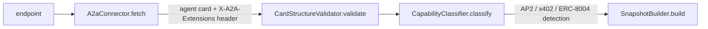

 

# a2a-agent-validator

Validates A2A Protocol Agent Cards end-to-end. Fetches the well-known endpoint, validates card structure against the A2A spec, classifies capabilities including [Google AP2 (Agent Payments Protocol)](https://github.com/google-agentic-commerce/AP2) and x402 extensions, and returns a structured snapshot with 16 boolean categories and 17 entry fields. Compatible with `erc8004-registry-parser` as a validation plugin.

## Quickstart

```bash
git clone https://github.com/agentprobe/a2a-agent-validator.git
cd a2a-agent-validator
npm i
```

```javascript
import { A2aAgentValidator } from 'a2a-agent-validator'

const { status, findings, categories, entries } = await A2aAgentValidator.start( {
    endpoint: 'https://agent.example.com',
    timeout: 15000
} )
```

## Features

- Fetches Agent Card from `/.well-known/agent-card.json` (A2A spec standard)
- Validates card structure: required fields, interfaces, skills, provider
- Classifies 16 boolean categories (reachable, skills, streaming, JSONRPC, GRPC, security, AP2, x402, embedded flow, ERC-8004)
- Detects **AP2 (Agent Payments Protocol)** via `capabilities.extensions` array and `X-A2A-Extensions` HTTP header — extracts version and roles
- Detects **x402** payment extensions and version
- Detects **Embedded Flow** (AP2 + x402 combined)
- Detects **ERC-8004** service links in agent card
- Extracts 17 entry fields (name, version, skills, protocols, provider, AP2 version/roles, x402 version, extensions)
- Compares two snapshots and produces a structured diff
- Returns empty snapshot with all-false categories on connection failure
- Compatible with `erc8004-registry-parser` via `.validate()` method

## Architecture

The validation pipeline processes an A2A Agent Card in four sequential steps:


```mermaid
flowchart LR
    A[endpoint] --> B[A2aConnector.fetch]
    B -->|agent card + X-A2A-Extensions header| C[CardStructureValidator.validate]
    C --> D[CapabilityClassifier.classify]
    D -->|AP2 / x402 / ERC-8004 detection| E[SnapshotBuilder.build]
```

## Methods

All methods are static and use object parameters with object returns.

### `.validate( { endpoint } )`

Simple validation compatible with `erc8004-registry-parser`. Returns only status and findings.

**Method**

```
.validate( { endpoint } )
```

| Key | Type | Description | Required |
|-----|------|-------------|----------|
| endpoint | string | Base URL of the A2A agent | Yes |

**Returns**

```javascript
{ status: true, findings: [] }
```

| Key | Type | Description |
|-----|------|-------------|
| status | boolean | `true` if card is valid |
| findings | object[] | Finding objects `{ code, severity, location, message }` |

---

### `.start( { endpoint, timeout } )`

Full validation with categories and entries.

**Method**

```
.start( { endpoint, timeout } )
```

| Key | Type | Description | Required |
|-----|------|-------------|----------|
| endpoint | string | Base URL of the A2A agent | Yes |
| timeout | number | Request timeout in ms (default: 10000) | No |

**Returns**

```javascript
{ status: true, findings: [], categories: { ... }, entries: { ... } }
```

| Key | Type | Description |
|-----|------|-------------|
| status | boolean | `true` if no validation errors |
| findings | object[] | Finding objects `{ code, severity, location, message }` |
| categories | object | 16 boolean capability flags |
| entries | object | 17 extracted data fields |

---

### `.compare( { before, after } )`

Compares two snapshots and returns a structured diff.

**Method**

```
.compare( { before, after } )
```

| Key | Type | Description | Required |
|-----|------|-------------|----------|
| before | object | Previous snapshot (from `.start()`) | Yes |
| after | object | Current snapshot (from `.start()`) | Yes |

**Returns**

```javascript
{ status: true, messages: [], hasChanges: false, diff: { ... } }
```

| Key | Type | Description |
|-----|------|-------------|
| status | boolean | Always `true` after validation |
| messages | string[] | Warning messages (different servers, timestamp order) |
| hasChanges | boolean | `true` if any diff detected |
| diff | object | Structured diff with sections: identity, capabilities, skills, interfaces, security, categories |

## Categories (16 boolean flags)

| Flag | Description |
|------|-------------|
| `isReachable` | HTTP response received from endpoint |
| `hasAgentCard` | Agent Card found and valid JSON |
| `hasValidStructure` | All required fields present |
| `hasSkills` | At least one skill defined |
| `hasSecuritySchemes` | Security schemes configured |
| `hasProvider` | Provider information present |
| `supportsStreaming` | `capabilities.streaming === true` |
| `supportsPushNotifications` | `capabilities.push_notifications === true` |
| `supportsJsonRpc` | Interface with `protocol_binding: 'JSONRPC'` |
| `supportsGrpc` | Interface with `protocol_binding: 'GRPC'` |
| `supportsExtendedCard` | `capabilities.extended_agent_card === true` |
| `hasDocumentation` | `documentation_url` present |
| `supportsAp2` | AP2 extension detected in `capabilities.extensions` or `X-A2A-Extensions` header |
| `supportsX402` | x402 extension detected in `capabilities.extensions` or `X-A2A-Extensions` header |
| `supportsEmbeddedFlow` | Both AP2 and x402 detected (agent supports embedded payment flow) |
| `hasErc8004ServiceLink` | ERC-8004 service link found in agent card |

## Entries (17 data fields)

| Entry | Type | Description |
|-------|------|-------------|
| `url` | string | Validated endpoint |
| `agentName` | string | Agent name |
| `agentDescription` | string | Agent description |
| `agentVersion` | string | Agent version |
| `providerOrganization` | string/null | Provider organization |
| `providerUrl` | string/null | Provider URL |
| `skillCount` | number | Number of skills |
| `skills` | array | Skills as `[{ id, name }]` |
| `protocolBindings` | array | Protocol bindings `['JSONRPC', 'GRPC']` |
| `protocolVersion` | string | First interface protocol version |
| `defaultInputModes` | array | Default input modes |
| `defaultOutputModes` | array | Default output modes |
| `ap2Version` | string/null | AP2 version extracted from extension URI (e.g. `"1.0"`) |
| `ap2Roles` | array/null | AP2 roles from `extension.params.roles` (e.g. `["buyer", "seller"]`) |
| `x402Version` | string/null | x402 version extracted from extension URI |
| `extensions` | string/null | Raw `X-A2A-Extensions` header value |
| `timestamp` | string | ISO 8601 timestamp |

## Validation Codes

Findings are emitted as structured objects `{ code, severity, location, message }` conforming to
the AgentProbe finding-object spec. `severity` is lowercase (`error` / `warning` / `info`). The
`VAL-1xx` and `CON-1xx` bands are the a2a-owned bands (hundreds digit `1`); `CSV-*` codes are
already globally unique and keep their numbers.

### VAL — Input Validation (band `VAL-1xx`)

| Code | Severity | Location | Message |
|------|----------|----------|---------|
| VAL-101 | error | endpoint | Missing value |
| VAL-102 | error | endpoint | Must be a string |
| VAL-103 | error | endpoint | Must not be empty |
| VAL-104 | error | endpoint | Must be a valid URL |
| VAL-105 | error | timeout | Must be a number |
| VAL-106 | error | timeout | Must be greater than 0 |
| VAL-107 | error | before | Missing value / Must be an object / Missing categories or entries |
| VAL-108 | error | after | Missing value / Must be an object / Missing categories or entries |

### CON — A2A Connection (band `CON-1xx`)

| Code | Severity | Location | Message |
|------|----------|----------|---------|
| CON-110 | info | null | Server not reachable |
| CON-111 | info | null | Agent Card not found (HTTP 404) |
| CON-112 | info | null | HTTP error |
| CON-113 | info | null | Response is not valid JSON |
| CON-114 | info | null | Request timeout exceeded |

### CSV — Card Structure Validation

| Code | Severity | Location | Message |
|------|----------|----------|---------|
| CSV-020 | warning | name | Missing required field "name" |
| CSV-021 | warning | description | Missing required field "description" |
| CSV-022 | warning | version | Missing required field "version" |
| CSV-023 | warning | supported_interfaces | Missing required field "supported_interfaces" |
| CSV-024 | warning | supported_interfaces | Must not be empty |
| CSV-025 | warning | capabilities | Missing required field "capabilities" |
| CSV-026 | warning | default_input_modes | Missing required field "default_input_modes" |
| CSV-027 | warning | default_output_modes | Missing required field "default_output_modes" |
| CSV-028 | warning | skills | Missing required field "skills" |
| CSV-030 | warning | supported_interfaces[i].url | Missing value |
| CSV-031 | warning | supported_interfaces[i].url | Must be a valid HTTPS URL |
| CSV-032 | warning | supported_interfaces[i].protocol_binding | Missing value |
| CSV-033 | warning | supported_interfaces[i].protocol_version | Missing value |
| CSV-034 | warning | skills[i].id | Missing value |
| CSV-035 | warning | skills[i].name | Missing value |
| CSV-036 | warning | skills[i].description | Missing value |
| CSV-037 | warning | skills[i].tags | Missing value |
| CSV-038 | warning | skills[i].tags | Must be a non-empty array |
| CSV-040 | warning | provider.url | Missing value |
| CSV-041 | warning | provider.organization | Missing value |

### CMP — Comparison

`CMP-*` codes are emitted by `.compare()` and are migrated to the structured finding shape in a
later phase; they are documented here for completeness.

| Code | Severity | Description |
|------|----------|-------------|
| CMP-001 | warning | Snapshots are from different agents |
| CMP-002 | warning | Before snapshot has no timestamp |
| CMP-003 | warning | After snapshot is older than before |

## License

MIT
